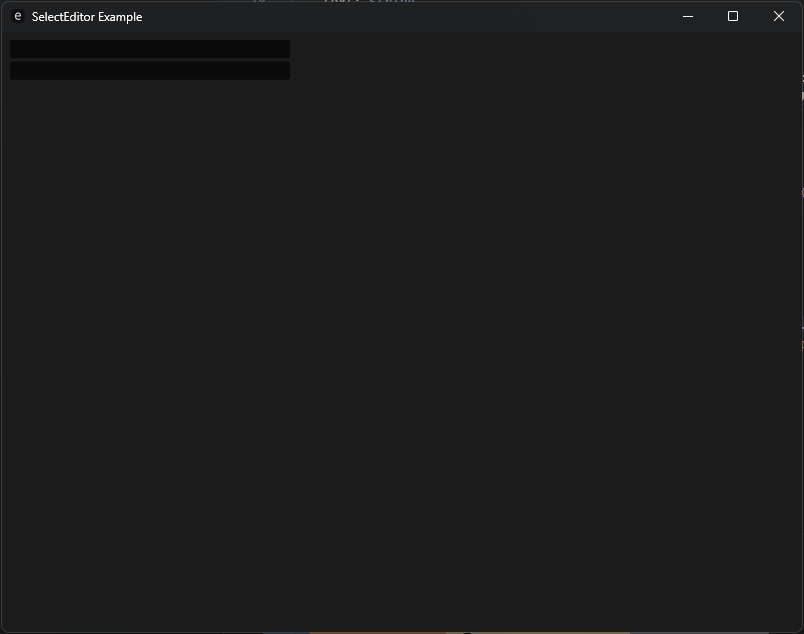
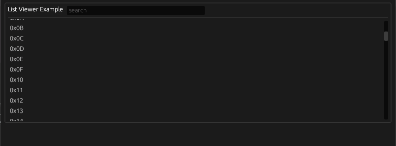
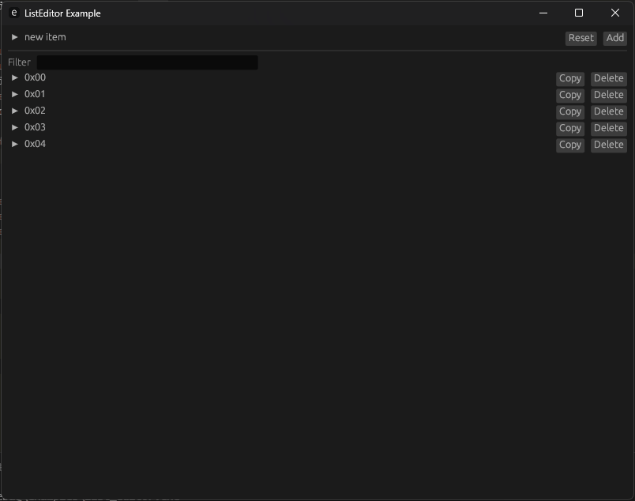

# egui_widgets

## OptionValue

```rust
use egui_widgets::OptionValue;

ui.add(OptionValue::new_full(
    &mut self.option_value,
    "Option String",
    |ui, value| ui.text_edit_singleline(value).changed(),
    || "default value".to_string(),
));
```


# SelectEditor

```rust
use egui_widgets::SelectEditor;

ui.add(SelectEditor::new(
    &mut self.text,
    ('a'..='z')
        .enumerate()
        .map(|c| c.1.to_string().repeat(c.0 + 1)),
));

ui.add(
    SelectEditor::new(
        &mut self.text,
        ('a'..='z')
            .enumerate()
            .map(|c| c.1.to_string().repeat(c.0 + 1)),
    )
    .filter(),
);
```



## ListViewer

用于展示只读的列表。[示例](examples/list_viewer.rs)




## ListEditor

用于编辑列表。[示例](examples/list_editor.rs)




## EguiTracing

捕获日志并显示。用简单筛选功能。[示例](examples/tracing.rs)


